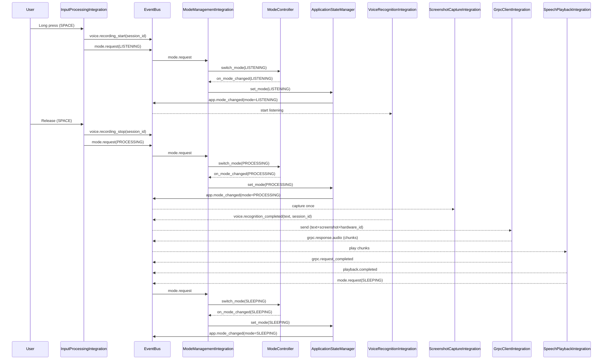
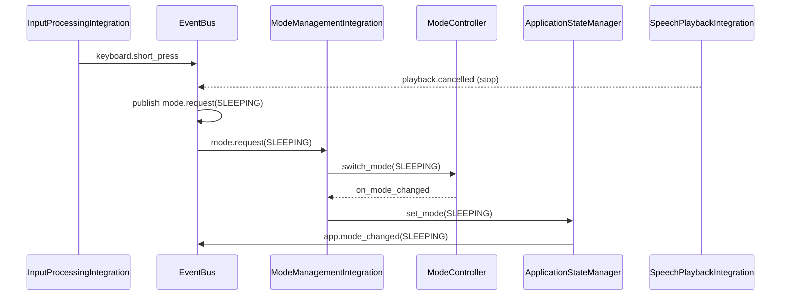

# 🧭 Nexy — Обзор Архитектуры

Этот документ — единая точка входа для понимания архитектуры, структуры и логики работы Nexy. Здесь описаны роли компонентов, жизненные циклы, события, правила централизации режимов и ожидаемые контракты между интеграциями и модулями.

- Целевая аудитория: разработчики интеграций и модулей Nexy
- Уровень детализации: практический (как это реально устроено в коде)

---

## 1) Картина в целом

Nexy — модульное приложение с событийной шиной (EventBus), централизованным менеджером состояния (ApplicationStateManager) и единым контроллером режимов (ModeController) в обертке ModeManagementIntegration. Вся межмодульная коммуникация — через события, а смена режимов — через централизованные заявки.

Главный цикл режимов: SLEEPING → LISTENING → PROCESSING → SLEEPING.

```
client/
├─ integration/                 # Слой интеграций (обертки над модулями)
│  ├─ core/
│  │  ├─ event_bus.py
│  │  ├─ state_manager.py
│  │  └─ simple_module_coordinator.py
│  └─ integrations/
│     ├─ input_processing_integration.py
│     ├─ voice_recognition_integration.py
│     ├─ speech_playback_integration.py
│     ├─ mode_management_integration.py  # Централизация режимов
│     ├─ interrupt_management_integration.py
│     ├─ grpc_client_integration.py
│     ├─ permissions_integration.py
│     ├─ audio_device_integration.py
│     └─ ...
└─ modules/                     # Переиспользуемые модули (без знания EventBus)
   ├─ mode_management/
   │  ├─ core/ (ModeController, типы)
   │  └─ modes/ (Sleeping/Listening/Processing)
   ├─ input_processing/
   ├─ voice_recognition/
   ├─ speech_playback/
   ├─ audio_device_manager/
   └─ ...
```

---

## 2) Основные роли и ответственность

- EventBus (integration/core/event_bus.py)
  - Централизованная событийная шина (publish/subscribe, приоритеты)
  - Изолирует компоненты, предотвращает плотные связки

- ApplicationStateManager (integration/core/state_manager.py)
  - Истинное текущие состояние приложения (режимы/история/данные)
  - Публикует события смены режима: `app.mode_changed`, `app.state_changed`
  - Не решает КАК переключать режимы — только фиксирует результат

- ModeController (modules/mode_management/core/mode_controller.py)
  - Единая логика переходов между режимами (карта переходов, обработчики, метрики)
  - Асинхронно сериализует переходы, предотвращает гонки

- ModeManagementIntegration (integration/integrations/mode_management_integration.py)
  - Центральный «рубильник» режимов
  - Принимает заявки `mode.request` и делегирует ModeController
  - По колбэку контроллера вызывает `state_manager.set_mode(...)` для публикации
  - Содержит правила/приоритеты источников, таймаут PROCESSING

- Интеграции (integration/integrations/*)
  - Адаптируют конкретные модули под событийный контракт
  - НЕ изменяют режим напрямую; только публикуют `mode.request`

- Модули (client/modules/*)
  - Самодостаточная функциональность (захват, распознавание, аудио и т.п.)
  - Не знают про EventBus/режимы; их «поведение в режимах» подключается через интеграции

---

## 3) Централизация режимов (Single Source of Truth)

- AppMode: единый импорт из `modules/mode_management` (дубликаты запрещены)
- Запрос смены режима: только событием `mode.request`
- Реальная смена режима: только через `ModeManagementIntegration → ModeController`
- Публикация факта смены: только `ApplicationStateManager.set_mode(...)`

Контракт запроса:

```python
await event_bus.publish("mode.request", {
  "target": AppMode.LISTENING,   # или SLEEPING / PROCESSING
  "source": "<integration|module>",
  # опционально: session_id, priority, data
})
```

Контракт уведомления:

```python
# Факт смены режима
await event_bus.publish("app.mode_changed", {"mode": AppMode.LISTENING})

# Мост (временный): старый формат для совместимости
await event_bus.publish("app.state_changed", {"old_mode": ..., "new_mode": ...})
```

Правила переходов (по умолчанию):
- SLEEPING → LISTENING
- LISTENING → PROCESSING, SLEEPING
- PROCESSING → SLEEPING

Таймаут PROCESSING: по умолчанию 45s (ModeManagementIntegration) → принудительный переход в SLEEPING через контроллер.

---

## 4) Главные потоки данных (PTT от клавиши до ответа)

1. Пользователь удерживает пробел (LONG_PRESS)
   - InputProcessingIntegration публикует `voice.recording_start(session_id)` и `mode.request(LISTENING)`
   - ModeManagementIntegration валидирует переход → ModeController → StateManager → `app.mode_changed`
   - VoiceRecognitionIntegration инициализирует запись/распознавание

2. Пользователь отпускает пробел (RELEASE)
   - InputProcessingIntegration публикует `voice.recording_stop(session_id)` и `mode.request(PROCESSING)`
   - VoiceRecognitionIntegration завершает распознавание → `voice.recognition_completed|failed|timeout`

3. Обработка результата
   - GrpcClientIntegration отправляет распознанный текст + контекст
   - Ответы аудио чанками → SpeechPlaybackIntegration проигрывает

4. Завершение
   - По окончанию воспроизведения или при неуспехе → `mode.request(SLEEPING)`
   - Итоговый факт смены режима публикует StateManager

Прерывания (interrupts)
- `keyboard.short_press` / `interrupt.request`
  - Останавливают воспроизведение/запись (события уровня интеграций)
  - Публикуют `mode.request(SLEEPING)` для возврата в базовый режим

---

## 5) Событийный контракт (основные темы)

- Режимы
  - `mode.request{target, source, ...}` — запрос смены
  - `app.mode_changed{mode}` — факт смены (источник истины)
  - `app.state_changed{old_mode, new_mode}` — мост для совместимости

- Голос
  - `voice.recording_start{session_id}`
  - `voice.recording_stop{session_id}`
  - `voice.recognition_started|completed|failed|timeout{session_id, ...}`

- gRPC / Ответы
  - `grpc.request_started|completed|failed{session_id, ...}`
  - `grpc.response.audio{bytes, shape, dtype, session_id}`
  - `grpc.response.end_message{session_id, message?}` (если сервер присылает финальный маркер)
  - Примечание: завершение обработчика PROCESSING должно опираться на `grpc.request_completed` (или `grpc.response.end_message`) либо на `playback.completed`, а не на фиксированный таймаут

- Воспроизведение
  - `playback.started|completed|failed|cancelled{session_id}`

- Сигналы (cues)
  - `signal.request{kind, pattern, volume?, device?, session_id?}`
  - `signal.completed|failed{pattern, ...}`
  - Рекомендуемые автосигналы: LISTENING→`listen_start`, playback.completed→`done`, ошибки/отмены→`error|cancel`

- Разрешения/Аудио/Сеть/Железо
  - `permissions.app_blocked|app_unblocked{...}`
  - `audio.device_switched|audio.device_snapshot{...}`
  - `network.status_changed{...}`
  - `hardware.id_obtained{...}`

Все имена событий и полезные нагрузки должны оставаться стабильными — это «договор» между интеграциями.

---

## 6) Правила предотвращения гонок и конфликтов

- Переключения режимов выполняются через `ModeController` (внутри — `asyncio.Lock`) → одно переключение за раз
- Источники заявок маркируются `source` (+ опционально `priority`) — конфликты решаются в ModeManagementIntegration
- Никаких прямых `state_manager.set_mode(...)` за пределами ModeManagementIntegration
- При внешней смене (на время миграции) ModeManagementIntegration синхронизирует свой контроллер по `app.mode_changed`

---

## 7) Конфигурация и расширяемость

- UnifiedConfigLoader — единый источник конфигураций интеграций и модулей
- Добавление нового модуля:
  1) Создать модуль в `client/modules/<name>` без знания EventBus
  2) Создать интеграцию в `client/integration/integrations/<name>_integration.py`
  3) Подписаться/публиковать нужные события, запросы режимов только через `mode.request`
  4) Добавить инициализацию/запуск в `SimpleModuleCoordinator`

- Расширение правил переходов:
  - Зарегистрировать новые `ModeTransition` в ModeManagementIntegration (или в конфиге)
  - Для специальных переходов — указать `action`, `priority`, `timeout`

---

## 8) Запуск и жизненный цикл

- SimpleModuleCoordinator управляет инициализацией/стартом/остановкой
  - Создаёт EventBus, StateManager, ErrorHandler
  - Поднимает фоновой asyncio loop и прикрепляет к EventBus
  - Создаёт и запускает интеграции (в т.ч. ModeManagementIntegration)
  - Прикрепляет EventBus к StateManager для публикации событий смены режимов

Последовательность (упрощенно):
1) Создание core-компонентов → 2) Запуск фонового loop → 3) Создание интеграций → 4) initialize() → 5) start() → 6) Подписки EventBus активны

---

## 9) Диагностика и ошибки

- ErrorHandler публикует/логирует ошибки с категорией и важностью
- Критические точки логирования:
  - Заявки на режим: входящие `mode.request`
  - Смена режимов: `app.mode_changed` (+ метрики ModeController)
  - Таймаут PROCESSING: принудительный возврат
  - Прерывания: `interrupt.request`, отмены, результаты

Рекомендации:
- Логируйте `source` и `session_id` для трассировки путей
- Не публикуйте «дублирующие» факты смены режима — только StateManager

— Завершение PROCESSING
- Сигналом завершения служит `grpc.request_completed` (получен end‑of‑stream) либо `playback.completed`
- Рекомендуется: `ModeManagementIntegration`/workflow PROCESSING переводит приложение в SLEEPING по одному из сигналов (что наступит раньше), а таймаут используется как защита

— Аутентификация gRPC (план)
- Вызовы gRPC должны поддерживать `metadata.authorization: Bearer <token>`
- Токен хранится в macOS Keychain (Auth/Chat — отложено)

---

## 10) Инварианты и чек‑лист для PR

- [ ] В коде интеграций нет прямых `set_mode(...)`
- [ ] Все запросы на смену режима идут через `mode.request`
- [ ] Импорт `AppMode` — только из `modules/mode_management`
- [ ] Подписки/публикации соответствуют контракту событий
- [ ] Новые переходы зарегистрированы в ModeManagementIntegration

---

## 11) Полезные файлы и ссылки

- Централизация режимов: `client/modules/mode_management/INTEGRATION_GUIDE.md`
- План интеграции: `client/Docs/INTEGRATION_MASTER_PLAN.md`
- План аутентификации и клиентского чата: отложено
- Координатор: `client/integration/core/simple_module_coordinator.py`
- Контроллер режимов: `client/modules/mode_management/core/mode_controller.py`
- Типы режимов: `client/modules/mode_management/core/types.py`
- Менеджер состояния: `client/integration/core/state_manager.py`

Если чего‑то не хватает в этом документе — предложите правки, мы обновим «источник истины» по архитектуре.

***

Последнее обновление: автоматически сгенерировано на базе актуального кода.

---

## 12) Каталог модулей (client/modules)

- `audio_device_manager` — управление устройствами ввода/вывода, автопереключение, колбэки смены; не знает про EventBus.
- `grpc_client` — низкоуровневый gRPC клиент, отправка запросов на сервер, управление соединением/ретраями.
- `hardware_id` — стабильный аппаратный идентификатор, кэш/TTL, фоновые обновления.
- `input_processing` — клавиатурные события (Quartz/pynput), детекция LONG/SHORT/RELEASE, конфиг порогов.
- `interrupt_management` — координация прерываний (типы/приоритеты/история), API для остановки записи/воспроизведения.
- `mode_management` — `ModeController`, типы, режимы (S/L/P), обработчики и метрики переходов.
- `network_manager` — мониторинг сети (ping/HTTP), события статуса, снапшоты.
- `permissions` — проверка и запрос системных разрешений (микрофон/захват экрана/сеть/уведомления).
- `screenshot_capture` — кроссплатформенный захват экрана, конфигурация качества/размера; на macOS — bridge/CLI fallback.
- `speech_playback` — последовательное воспроизведение аудио чанков, буферизация, управление устройством.
- `tray_controller` — UI-иконка/меню, статусы для режимов.
- `update_manager` — проверка/скачивание обновлений, AppCast, интеграция со Sparkle.
- `voice_recognition` — запись/распознавание речи, симулятор/реальный движок, таймауты, отмена.

Примечание: модули не знают про EventBus/режимы напрямую — это делает слой интеграций.

---

## 13) Каталог интеграций (client/integration/integrations)

- `mode_management_integration.py`
  - Назначение: единый «рубильник» режимов; принимает `mode.request`, делегирует `ModeController`, публикует факт через `StateManager`.
  - Подписки: `mode.request`, `app.mode_changed`, мосты `keyboard.*`, `grpc.request_*`, `playback.*`, `interrupt.request`.
  - Публикует: при успехе — `app.mode_changed` (через StateManager), вспомогательные мосты.

- `input_processing_integration.py`
  - Назначение: PTT-клавиатура, генерирует `voice.recording_start/stop`, заявки на режим LISTENING/PROCESSING.
  - Подписки: внутренние колбэки от KeyboardMonitor, `voice.recognition_*` (fail/timeout).
  - Публикует: `keyboard.press/short_press/long_press/release`, `voice.recording_start/stop`, `mode.request(LISTENING|PROCESSING|SLEEPING)`.

- `voice_recognition_integration.py`
  - Назначение: запуск/остановка распознавания, публикация результатов.
  - Подписки: `mode.switch` (если используется), внутренние старт/стоп записи, таймеры; реагирует на смену режима.
  - Публикует: `voice.recognition_started|completed|failed|timeout`, `mode.request(SLEEPING)` при fail/timeout.

- `grpc_client_integration.py`
  - Назначение: агрегирует `text + screenshot + hardware_id`, отправляет StreamRequest, транслирует ответы в события.
  - Подписки: `voice.recognition_completed`, `screenshot.captured`, `hardware.id_*`, `keyboard.short_press` (cancel), `interrupt.request`, `network.status_changed`, `app.shutdown`.
  - Публикует: `grpc.request_started|completed|failed`, `grpc.response.audio`.

- `speech_playback_integration.py`
  - Назначение: воспроизведение аудио чанков ответа, корректное завершение/отмена.
  - Подписки: `grpc.response.audio`, `grpc.request_completed|failed`, `keyboard.short_press`, `interrupt.request`, `app.shutdown`.
  - Публикует: `playback.started|completed|failed|cancelled`, `mode.request(SLEEPING)` по завершению/ошибке/тишине.

- `screenshot_capture_integration.py`
  - Назначение: один скриншот при входе в PROCESSING; CLI‑fallback при отсутствии модуля.
  - Подписки: `app.mode_changed`, `voice.recording_stop`, `permissions.*` статусы.
  - Публикует: `screenshot.captured` (jpeg/webp), `screenshot.error`.

- `audio_device_integration.py`
  - Назначение: автоуправление устройствами/микрофоном по режимам.
  - Подписки: `app.startup`, `app.shutdown`, `app.state_changed`, `app.mode_changed`.
  - Публикует: `audio.device_snapshot`, `audio.device_switched`, ошибки аудио.

- `permissions_integration.py`
  - Назначение: проверка обязательных разрешений, блокировка приложения при отсутствии.
  - Подписки: `app.startup`, `app.shutdown`, `app.mode_changed`, внутренние запросы проверки.
  - Публикует: `permissions.status_checked`, `permissions.critical_status`, `permissions.app_blocked|app_unblocked`, `mode.request(SLEEPING)` при блокировке.

- `network_manager_integration.py`
  - Назначение: мониторинг сети, снапшоты, события смены.
  - Подписки: `app.startup`, `app.shutdown`.
  - Публикует: `network.status_snapshot`, `network.status_changed`.

- `hardware_id_integration.py`
  - Назначение: получение и кэширование hardware_id; ответы по запросу.
  - Подписки: `app.startup`, `hardware.id_request`, `hardware.id_refresh`, `app.shutdown`.
  - Публикует: `hardware.id_obtained`, `hardware.id_response`, `hardware.id_error`.

- `tray_controller_integration.py`
  - Назначение: отображение статуса/меню в трее.
  - Подписки: `app.mode_changed`, `keyboard.*`, `voice.mic_opened|closed`, `audio.device_*`.
  - Публикует: `tray.status_updated`.

- `update_manager_integration.py`
  - Назначение: координация обновлений приложения на стороне клиента, события статусов.
  - Подписки/Публикации: см. файл интеграции; использует EventBus для анонсов и состояния.

Инвариант: все смены режимов запрашиваются только через `mode.request`; факт смены — только от StateManager.

---

## 14) Диаграммы (Mermaid)

Быстрые схемы для понимания потоков и централизации. GitHub рендерит диаграммы Mermaid, в IDE можно открыть Markdown Preview.

PTT: SLEEPING → LISTENING → PROCESSING → SLEEPING (happy path)



Короткое нажатие (interrupt): немедленный возврат в SLEEPING



Централизация смены режима

```mermaid
flowchart LR
    subgraph Integrations
      A[InputProcessing] -->|mode.request| MM
      B[VoiceRecognition] -->|mode.request| MM
      C[SpeechPlayback] -->|mode.request| MM
      D[Permissions] -->|mode.request| MM
      E[Interrupts] -->|mode.request| MM
    end
    MM[ModeManagementIntegration]\n(принимает заявки) --> MC[ModeController]\n(правила переходов)
    MC -->|callback| SM[ApplicationStateManager]\nset_mode()
    SM --> EB[EventBus]\napp.mode_changed
    EB --> Consumers[Все подписчики]
```
