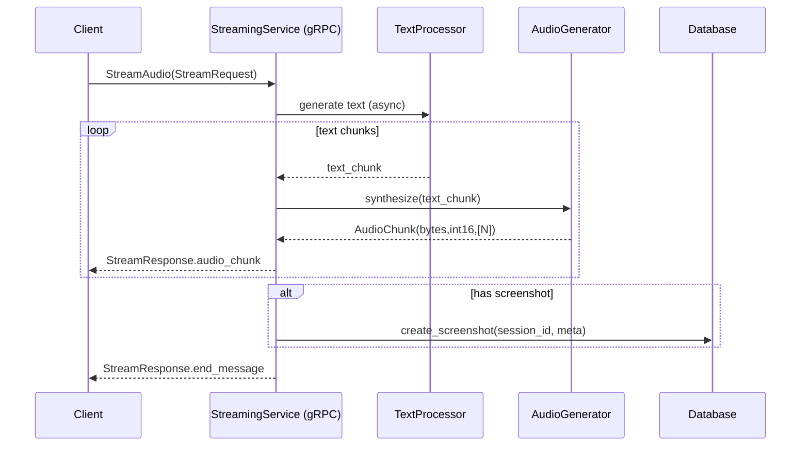
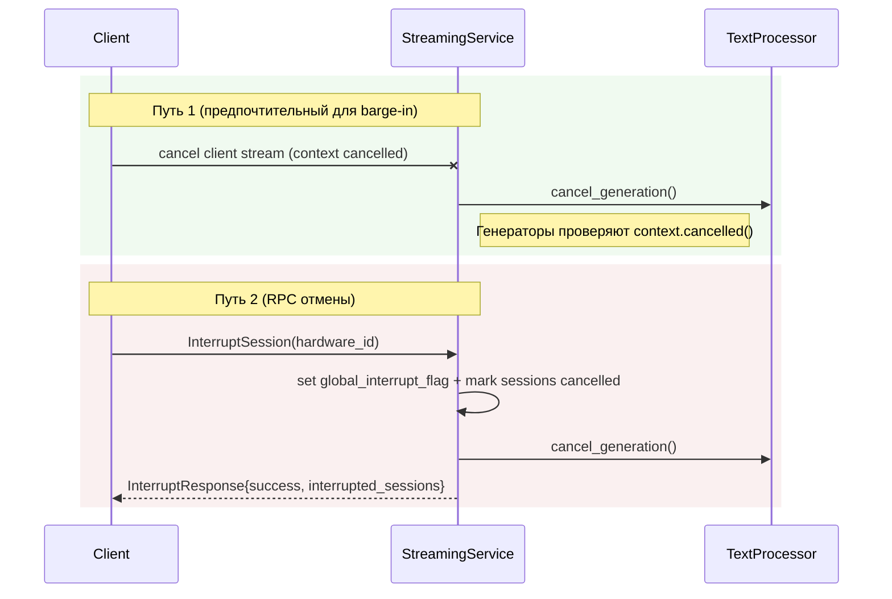

# 🧭 Nexy Server — Обзор Архитектуры

Этот документ описывает архитектуру, структуру и логику серверной части Nexy: роли компонентов, поток данных, контракты gRPC, работу с памятью/БД, прерывания и контроль качества.

— Аудит кода: server/main.py, grpc_server.py, text_processor.py, audio_generator.py, database/*, streaming.proto, update_server.py

---

## 1) Картина в целом

Сервер — асинхронный gRPC сервис для обработки запросов от клиента:
- Принимает промпт и (опционально) скриншот/метаданные экрана
- Генерирует ответные текстовые чанки и синтезирует аудио (TTS)
- Поддерживает прерывание сессий (interrupt)
- Экспортирует простые HTTP endpoints для health/status
- Опционально поднимает встроенный Update Server (Sparkle/AppCast)

Главные компоненты:
- grpc_server.py — реализация gRPC сервиса (StreamingServicer) и «serve»
- text_processor.py — генерация текста: Gemini Live API (основной) / LangChain (fallback) / упрощённый ответ
- audio_generator.py — синтез речи: Azure Cognitive Services (основной) / Edge TTS (fallback) / локальный синус
- database/* — менеджер БД, хранение сессий и скриншотов
- streaming.proto — контракт gRPC
- main.py — точка запуска HTTP + gRPC (+ Update Server)

---

## 2) Контракт gRPC (streaming.proto)

Сервис: `StreamingService`
- `rpc StreamAudio(StreamRequest) returns (stream StreamResponse);` — серверный стриминг
- `rpc InterruptSession(InterruptRequest) returns (InterruptResponse);` — прерывание активных сессий

Сообщения:
- `StreamRequest { string prompt; optional string screenshot; optional int32 screen_width; optional int32 screen_height; string hardware_id; optional string session_id; }`
- `StreamResponse { oneof content { string text_chunk; AudioChunk audio_chunk; string end_message; string error_message; } }`
- `AudioChunk { bytes audio_data; string dtype; repeated int32 shape; }`  — dtype: например `int16`; shape: `[N]`

Требования согласования с клиентом:
- Аудио формат: 48 kHz, mono, int16 (PCM s16le). Если движок TTS выдаёт другой формат, конвертировать на сервере.
- Ошибки/отмена: при клиентском отмене стрима (context cancelled) не отправлять `end_message`; допускается логировать отмену и корректно завершать обработку без ошибок.

Размеры сообщений: сервер сконфигурирован на прием/отдачу до 50MB.

---

## 3) Поток обработки (StreamAudio)

1) Приём запроса: prompt, hardware_id, screenshot (+размеры экрана)
2) Инициализация сессии: учёт в `active_sessions`, генерация `session_id` при необходимости
3) Генерация текста (TextProcessor): асинхронный генератор текстовых чанков
4) Для каждого `text_chunk` — синтез аудио (AudioGenerator) → отправка `StreamResponse.audio_chunk`
5) Финализация: отправка `end_message` и закрытие стрима; сохранение скриншота в БД (если указан)

Прерывания и отмена:
- Клиент может отменить активный стрим двумя путями:
  1) Отмена клиентского контекста RPC (preferred для «barge‑in»). Сервер обязан часто проверять `context.cancelled()`/`context.is_active()` и немедленно прекращать генерацию текста/аудио без отправки `end_message`.
  2) Вызов `InterruptSession(hardware_id)` — сервер выставляет `global_interrupt_flag` и помечает активные сессии как `cancelled`, что прерывает генерацию.
- Генераторы (текст/аудио) должны регулярно проверять оба сигнала: глобфлаг/статус сессии и отмену контекста.
- После отмены никаких «поздних» чанков не должны отправляться в поток (важно для клиентского фильтрации и UX barge‑in).

Хранение:
- При наличии скриншота — создается запись в БД (`database_manager.create_screenshot`) с метаданными.

---

## 4) Генерация текста (text_processor.py)

Стратегия «многоуровневый фолбэк»:
- Основной: Google Gemini Live API (если установлен и настроен)
  - Настройка поискового инструмента (обязательно для «актуальной» информации)
  - System prompt (role/правила ответа) задается в конфигурации сессии
- Fallback: LangChain + Gemini (если доступно)
- Локальный упрощённый фолбэк: если нет ключей/SDK — отдаётся короткий текстовый ответ-заглушка

Особенности:
- Асинхронный генератор текста (streaming), отдаёт «кусочки» текста
- Имеется мгновенная отмена генерации (`cancel_generation()`)
- Интеграция с памятью/БД (MemoryAnalyzer) — опционально при наличии ключей

---

## 5) Синтез аудио (audio_generator.py)

Стратегия «многоуровневый фолбэк»:
- Основной: Azure Cognitive Services TTS
  - Выход: 48000Hz, 16-bit, mono PCM
  - Конвертация в numpy массив `int16`
- Fallback: Edge TTS (WebSocket) с retry и timeout
- Локальный фолбэк: синус/«бип» для крайнего случая

На выход отправляется `AudioChunk` с `audio_data` (raw bytes), `dtype` (например `int16`) и `shape` (`[N]`).

---

## 6) База данных и память

- `database/database_manager.py` — подключение к БД (SQLite по умолчанию), CRUD сессий и скриншотов
- Создание скриншота: путь (локальный), URL (опц.), метаданные (base64_length, формат, разрешение экрана)
- `TextProcessor.set_database_manager(...)` — интеграция для использования памяти/истории при генерации

---

## 7) Прерывания (InterruptSession)

- RPC: `InterruptSession(InterruptRequest{hardware_id})` → `InterruptResponse{success, interrupted_sessions, message}`
- Механика:
  - Устанавливается `global_interrupt_flag` и `interrupt_hardware_id`
  - Все активные сессии помечаются `cancelled=True`
  - В цикле генерации текста/аудио есть частые проверки флага и статуса сессии
- Клиент после прерывания обычно возвращает приложение в `SLEEPING`

---

## 8) Конфигурация (config.py, config.env)

- Параметры: ключи Gemini/ Azure Speech, порт gRPC/HTTP, БД, настройки Edge TTS
- `Config.validate()` вызывается при запуске из `grpc_server` (в __main__) и в main.py по месту
- В проде все переменные задаются через `config.env`/переменные окружения

---

## 9) Запуск и сервисы (main.py)

- HTTP (aiohttp) на 8080: `/health`, `/`, `/status`
- gRPC на `Config.GRPC_PORT` (по умолчанию 50051)
- Update Server (опц.) на 8081: AppCast и раздача обновлений
- Все сервисы запускаются из `async def main()`; корректная остановка по Ctrl+C

---

## 10) Масштабирование и надежность

- Асинхронный gRPC (`grpc.aio`) с настройками максимального размера сообщений (50MB)
- Параллельные сессии: управление через `active_sessions` + проверки отмены
- Потенциальный горизонтальный скейл: за счёт stateless‑логики; глобфлаг прерывания и активные сессии привязаны к инстансу (для мульти‑инстанса требуется внешний координационный слой: Redis/pubsub)
- Рекомендации продакшн:
  - Пропагировать interrupt через внешний стор (Redis) при k>1 инстансе
  - Сохранение скриншотов/логов в object storage (S3/GCS) вместо локального `/tmp`
  - Ограничение времени сессии/тайм‑ауты на уровне gRPC контекста

---

## 11) Наблюдаемость и логирование

- Единая настройка logging.basicConfig в grpc_server/main
- Подробные логи на ключевых этапах: приём запроса, начало/окончание стрима, генерация/TTС, прерывания (включая отличение client‑cancel vs server‑error)
- Диагностические принты включены в StreamAudio для локальной отладки (можно отключить/понизить уровень)

---

## 12) Чек‑лист инвариантов

- [ ] Любая генерация текста отменяема (cancel_generation + проверки флагов)
- [ ] TTS всегда возвращает корректный формат: 48 kHz, int16 mono (или корректно конвертируется)
- [ ] Контекст gRPC проверяется на отмену внутри циклов
- [ ] Размеры сообщений согласованы с клиентом (до 50MB)
- [ ] При наличии скриншота создаётся запись в БД с метаданными

— Дополнительно для barge‑in клиента (press‑first):
- [ ] При отмене контекста стрим мгновенно прекращается, без «хвостовых» аудио чанков
- [ ] Нет отправки `end_message` при отмене; допускается лог «cancelled by client»

---

## 13) Полезные файлы

- gRPC сервис: `server/grpc_server.py`, `server/streaming.proto`
- Текст: `server/text_processor.py`
- Аудио: `server/audio_generator.py`
- БД: `server/database/database_manager.py`
- Конфиг: `server/config.py`, `server/config.env(.example)`
- Запуск: `server/main.py`
- Обновления: `server/update_server.py`, `server/updates/*`

Если чего‑то не хватает — создайте Issue/PR, этот документ является «источником истины» по серверной архитектуре.

---

## 14) Диаграммы (Mermaid)

Поток StreamAudio (серверный стриминг)



Прерывание сессий (два пути)



Общий вид компонентов сервера

```mermaid
flowchart LR
  subgraph Runtime
    A[HTTP Server :8080\n/health /status]
    B[gRPC Server :50051\nStreamingService]
    C[Update Server :8081\nAppCast/Downloads]
  end
  B --> TP[TextProcessor\nGemini Live / LangChain / Fallback]
  B --> TTS[AudioGenerator\nAzure / Edge TTS / Local]
  B --> DB[(Database)]
  Client[[Client App]] -->|gRPC| B
  Client -.->|HTTP (health)| A
```
