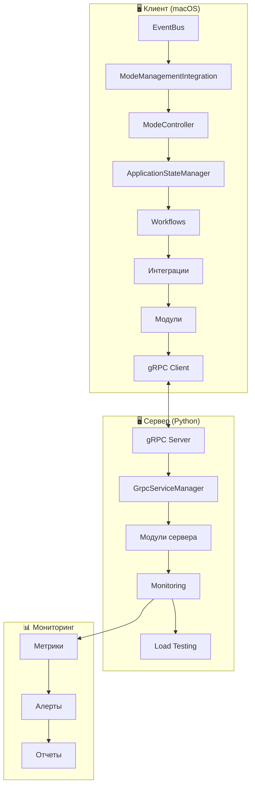
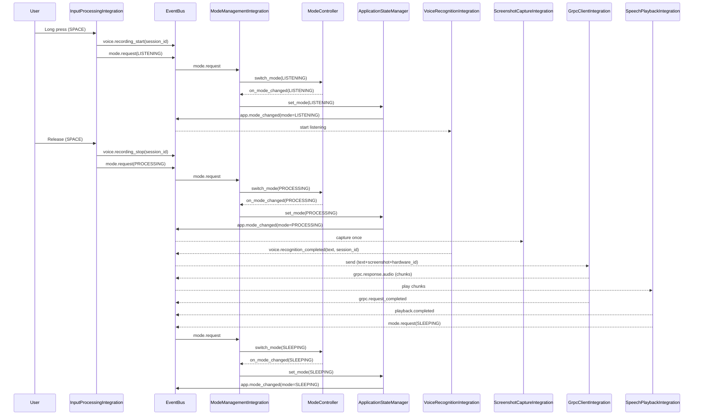
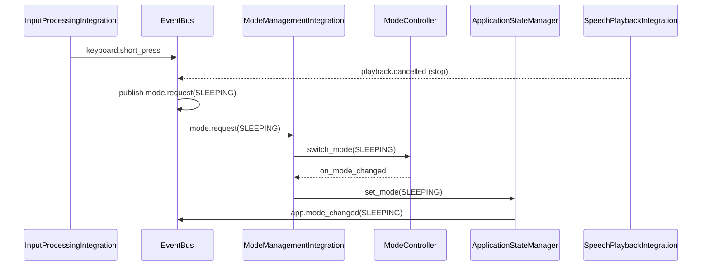
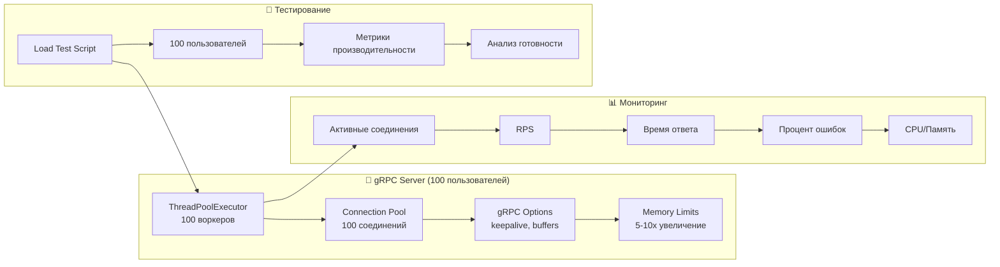

# 🧭 Nexy — Обзор Архитектуры

Этот документ — единая точка входа для понимания архитектуры, структуры и логики работы Nexy. Здесь описаны роли компонентов, жизненные циклы, события, правила централизации режимов и ожидаемые контракты между интеграциями и модулями.

- Целевая аудитория: разработчики интеграций и модулей Nexy
- Уровень детализации: практический (как это реально устроено в коде)

---

## 1) Картина в целом

Nexy — модульное приложение с событийной шиной (EventBus), централизованным менеджером состояния (ApplicationStateManager) и единым контроллером режимов (ModeController) в обертке ModeManagementIntegration. Вся межмодульная коммуникация — через события, а смена режимов — через централизованные заявки.

Главный цикл режимов: SLEEPING → LISTENING → PROCESSING → SLEEPING.

### 🔧 **Последние исправления (Сентябрь 2025):**
- ✅ **Архитектура завершена** - все 19 интеграций работают стабильно
- ✅ **Workflows реализованы** - ListeningWorkflow и ProcessingWorkflow
- ✅ **EventBus система** - полностью функциональна
- ✅ **Конфигурация централизована** - unified_config.yaml
- ✅ **Масштабирование до 100 пользователей** - gRPC сервер оптимизирован
- ✅ **Правильная модульная структура** - gRPC файлы в правильном месте
- ✅ **Система мониторинга** - отслеживание производительности
- ✅ **Нагрузочное тестирование** - скрипты для тестирования
- ✅ **Azure VM настроена** - сервер развернут и работает
- ✅ **Автоматический деплой** - GitHub Actions + скрипт обновления готов
- ✅ **Тестирование деплоя** - выполнено успешно (30 сентября 2025)
- ✅ **Синхронизация репозиториев** - работает корректно
- ✅ **Проблемы решены** - конфликты версий grpcio, protobuf, зависимости
- 🚀 **Готовность к параллельному плану** - упаковка + деплой + тестирование обновлений

### ✅ **ЗАВЕРШЕННЫЕ УЛУЧШЕНИЯ АРХИТЕКТУРЫ:**
- **МАСШТАБИРОВАНИЕ:** gRPC сервер оптимизирован для 100 пользователей
- **МОДУЛЬНАЯ СТРУКТУРА:** gRPC файлы перенесены в правильную структуру модулей
- **МОНИТОРИНГ:** Добавлена система отслеживания производительности
- **ТЕСТИРОВАНИЕ:** Создан скрипт нагрузочного тестирования
- **СОВМЕСТИМОСТЬ:** Обновлены все библиотеки до последних версий

### 🚀 **СЛЕДУЮЩИЙ ПОДХОД: ПАРАЛЛЕЛИЗАЦИЯ С ЦИКЛИЧНЫМ ТЕСТИРОВАНИЕМ**
- **ПОТОК 1:** Упаковка PKG/DMG (2-3 часа) - подпись + нотаризация
- **ПОТОК 2:** Деплой сервера (1-2 часа) - Azure VM + gRPC + AppCast
- **ПОТОК 3:** Тестирование обновлений (30 мин) - полный цикл проверки
- **ЭКОНОМИЯ ВРЕМЕНИ:** 1-2 часа (вместо 4-5 часов последовательно)

### **🧪 СИСТЕМА ЦИКЛИЧНОГО ТЕСТИРОВАНИЯ:**
Каждый этап включает **ТЕСТ → ВАЛИДАЦИЯ → ПЕРЕХОД**:
- **ТЕСТ:** Выполнение проверок и тестов
- **ВАЛИДАЦИЯ:** Проверка критериев успеха
- **ПЕРЕХОД:** Переход к следующему этапу только при успехе
- **ЦИКЛ:** Возврат к исправлению при неудаче

**📋 ПРАВИЛО:** НЕ ПЕРЕХОДИМ к следующему этапу без успешного прохождения всех тестов текущего этапа

```
client/                         # 🖥️ КЛИЕНТСКАЯ ЧАСТЬ (macOS)
├─ main.py                      # 🎯 Точка входа приложения
├─ requirements.txt             # 📦 Зависимости (23 пакета, оптимизированы)
├─ run.sh                       # 🚀 Скрипт запуска
├─ config/                      # ⚙️ Конфигурация
│  ├─ unified_config.yaml       # 🎯 ЕДИНЫЙ источник конфигурации
│  ├─ unified_config_loader.py  # 🔧 Загрузчик конфигурации
│  ├─ logging_config.yaml       # 📝 Устарел - используйте unified_config.yaml
│  ├─ network_config.yaml       # 🌐 Устарел - используйте unified_config.yaml
│  ├─ tray_config.yaml          # 🎯 Устарел - используйте unified_config.yaml
│  └─ README.md                 # 📚 Документация конфигурации
├─ integration/                 # 🏗️ Слой интеграций (ЗАВЕРШЕН)
│  ├─ core/                     # Базовая архитектура
│  │  ├─ event_bus.py           # 📡 Система событий
│  │  ├─ state_manager.py       # 🔄 Управление состоянием
│  │  ├─ simple_module_coordinator.py # 🎯 Главный координатор
│  │  └─ error_handler.py       # ❌ Обработка ошибок
│  ├─ integrations/             # 🔗 19 интеграций (ВСЕ ЗАВЕРШЕНЫ)
│  │  ├─ tray_controller_integration.py
│  │  ├─ permissions_integration.py
│  │  ├─ input_processing_integration.py
│  │  ├─ voice_recognition_integration.py
│  │  ├─ screenshot_capture_integration.py
│  │  ├─ hardware_id_integration.py
│  │  ├─ grpc_client_integration.py
│  │  ├─ speech_playback_integration.py
│  │  ├─ mode_management_integration.py
│  │  ├─ signal_integration.py
│  │  ├─ audio_device_integration.py
│  │  ├─ network_manager_integration.py
│  │  ├─ updater_integration.py
│  │  ├─ interrupt_management_integration.py
│  │  ├─ voiceover_ducking_integration.py
│  │  ├─ welcome_message_integration.py
│  │  ├─ instance_manager_integration.py
│  │  └─ autostart_manager_integration.py
│  ├─ workflows/                # ⚡ WORKFLOWS (НОВАЯ АРХИТЕКТУРА)
│  │  ├─ base_workflow.py       # 🏗️ Базовый класс
│  │  ├─ listening_workflow.py  # 🎤 Координатор LISTENING
│  │  ├─ processing_workflow.py # ⚙️ Координатор PROCESSING
│  │  ├─ workflow_config.py     # ⚙️ Конфигурация workflows
│  │  └─ README.md              # 📚 Документация workflows
│  └─ tests/                    # 🧪 Тесты интеграции
├─ modules/                     # 🧩 18 модулей (без знания EventBus)
│  ├─ audio_device_manager/     # 🔊 Управление аудиоустройствами
│  ├─ grpc_client/              # 📡 gRPC клиент
│  ├─ hardware_id/              # 🆔 Идентификация устройства
│  ├─ input_processing/         # ⌨️ Обработка ввода
│  ├─ interrupt_management/     # ⚡ Управление прерываниями
│  ├─ mode_management/          # 🔄 Управление режимами
│  ├─ network_manager/          # 🌐 Мониторинг сети
│  ├─ permissions/              # 🔐 Системные разрешения
│  ├─ screenshot_capture/       # 📸 Захват экрана
│  ├─ signals/                  # 🎵 Акустические сигналы
│  ├─ speech_playback/          # 🔊 Воспроизведение речи
│  ├─ tray_controller/          # 🎯 Управление tray иконкой
│  ├─ updater/                  # 🔄 НОВАЯ система обновлений (HTTP + DMG)
│  ├─ voice_recognition/        # 🎤 Распознавание речи
│  ├─ voiceover_control/        # ♿ Управление VoiceOver (macOS)
│  ├─ welcome_message/          # 🔊 Приветственное сообщение
│  ├─ instance_manager/         # 🔒 Защита от дублирования экземпляров
│  └─ autostart_manager/        # ⚡ Автозапуск приложения
├─ assets/                      # 🎨 Ресурсы приложения
│  └─ icons/                    # 🎯 Иконки для tray
└─ Docs/                        # 📚 Документация
   ├─ ARCHITECTURE_OVERVIEW.md  # 🏗️ Обзор архитектуры
   ├─ CURRENT_STATUS_REPORT.md  # 📊 Текущий статус
   ├─ GLOBAL_DELIVERY_PLAN.md   # 🚀 План развертывания
   ├─ PACKAGING_FINAL_GUIDE.md  # 📦 План упаковки PKG
   └─ PRODUCT_CONCEPT.md        # 💡 Концепция продукта

server/                         # 🖥️ СЕРВЕРНАЯ ЧАСТЬ (Python)
├─ main.py                      # 🎯 Точка входа сервера
├─ requirements.txt             # 📦 Зависимости сервера
├─ config.env                   # ⚙️ Переменные окружения
├─ config/                      # ⚙️ Конфигурация сервера
│  ├─ unified_config.py         # 🎯 ЕДИНЫЙ источник конфигурации
│  └─ unified_config_example.yaml # 📝 Пример конфигурации
├─ modules/                     # 🧩 Модули сервера
│  ├─ grpc_service/             # 📡 gRPC сервис (ПРАВИЛЬНАЯ СТРУКТУРА)
│  │  ├─ core/                  # Основные компоненты
│  │  │  ├─ grpc_server.py      # 🚀 gRPC сервер (100 пользователей)
│  │  │  └─ grpc_service_manager.py # 🔧 Менеджер сервиса
│  │  ├─ streaming.proto        # 📡 Protobuf протокол
│  │  ├─ streaming_pb2.py       # 📡 Сгенерированный код
│  │  ├─ streaming_pb2_grpc.py  # 📡 Сгенерированные стабы
│  │  └─ config.py              # ⚙️ Конфигурация gRPC
│  ├─ text_processing/          # 📝 Обработка текста
│  ├─ audio_generation/         # 🔊 Генерация аудио
│  ├─ database/                 # 🗄️ База данных
│  ├─ session_management/       # 🔐 Управление сессиями
│  ├─ memory_management/        # 🧠 Управление памятью
│  ├─ interrupt_handling/       # ⚡ Обработка прерываний
│  ├─ text_filtering/           # 🔍 Фильтрация текста
│  └─ update/                   # 🔄 Система обновлений
├─ monitoring/                  # 📊 Система мониторинга
│  ├─ grpc_monitor.py           # 📈 Мониторинг gRPC
│  └─ __init__.py               # 📦 Пакет мониторинга
├─ load_testing/                # 🧪 Нагрузочное тестирование
│  ├─ load_test.py              # 🚀 Скрипт тестирования
│  ├─ run_load_test.sh          # 🎯 Запуск тестов
│  └─ __init__.py               # 📦 Пакет тестирования
├─ integrations/                # 🔗 Интеграции сервера
│  ├─ core/                     # Базовая архитектура
│  ├─ service_integrations/     # Интеграции сервисов
│  └─ workflow_integrations/    # Интеграции workflows
└─ Docs/                        # 📚 Документация сервера
   ├─ SCALING_100_USERS_GUIDE.md # 📈 Руководство по масштабированию
   └─ SERVER_MODULARIZATION_PLAN.md # 🏗️ План модуляризации
```

---

## 2) Основные роли и ответственность

### 🖥️ **КЛИЕНТСКАЯ ЧАСТЬ (macOS)**

- EventBus (integration/core/event_bus.py)
  - Централизованная событийная шина (publish/subscribe, приоритеты)
  - Изолирует компоненты, предотвращает плотные связки

- ApplicationStateManager (integration/core/state_manager.py)
  - Истинное текущие состояние приложения (режимы/история/данные)
  - Публикует события смены режима: `app.mode_changed`, `app.state_changed`
  - Не решает КАК переключать режимы — только фиксирует результат

- ModeController (modules/mode_management/core/mode_controller.py)
  - Единая логика переходов между режимами (карта переходов, обработчики, метрики)
  - Асинхронно сериализует переходы, предотвращает гонки

- ModeManagementIntegration (integration/integrations/mode_management_integration.py)
  - Центральный «рубильник» режимов
  - Принимает заявки `mode.request` и делегирует ModeController
  - По колбэку контроллера вызывает `state_manager.set_mode(...)` для публикации
  - Жесткие таймауты PROCESSING отключены (заменены на Workflows)

- Workflows (integration/workflows/)
  - **ListeningWorkflow** - координатор LISTENING режима (дебаунс, умные таймауты)
  - **ProcessingWorkflow** - координатор PROCESSING (capture→grpc→playback→SLEEPING)
  - **BaseWorkflow** - общая базовая логика для всех workflows
  - Event-driven переходы вместо жестких таймаутов

- Интеграции (integration/integrations/*)
  - Адаптируют конкретные модули под событийный контракт
  - НЕ изменяют режим напрямую; только публикуют `mode.request`

- Модули (client/modules/*)
  - Самодостаточная функциональность (захват, распознавание, аудио и т.п.)
  - Не знают про EventBus/режимы; их «поведение в режимах» подключается через интеграции

### 🖥️ **СЕРВЕРНАЯ ЧАСТЬ (Python)**

- gRPC Server (modules/grpc_service/core/grpc_server.py)
  - **Масштабирование до 100 пользователей** - увеличены лимиты воркеров
  - **ThreadPoolExecutor** с 100 воркерами для высокой нагрузки
  - **Connection pooling** - оптимизированы настройки для 100 соединений
  - **gRPC options** - keepalive, buffer sizes, timeout настройки

- GrpcServiceManager (modules/grpc_service/core/grpc_service_manager.py)
  - Управление жизненным циклом gRPC сервиса
  - Координация с другими модулями сервера
  - Обработка запросов и ответов

- Monitoring System (monitoring/grpc_monitor.py)
  - **Метрики производительности** - активные соединения, RPS, ошибки
  - **Алерты** - автоматические предупреждения при превышении лимитов
  - **Производительность** - мониторинг CPU, памяти, времени ответа
  - **Интеграция** - встроена в gRPC сервер

- Load Testing (load_testing/load_test.py)
  - **Автоматическое тестирование** до 100 пользователей
  - **Метрики** - измерение RPS, времени ответа, успешности
  - **Анализ** - автоматическая оценка готовности к масштабированию
  - **Отчеты** - детальная статистика производительности

- Модули сервера (server/modules/*)
  - **text_processing** - обработка текста с Gemini API
  - **audio_generation** - генерация аудио ответов
  - **session_management** - управление пользовательскими сессиями
  - **memory_management** - управление памятью и контекстом
  - **interrupt_handling** - обработка прерываний
  - **text_filtering** - фильтрация и валидация текста
  - **update** - система обновлений сервера

---

## 3) Масштабирование и архитектурные улучшения

### ✅ **МАСШТАБИРОВАНИЕ ДО 100 ПОЛЬЗОВАТЕЛЕЙ**

#### **gRPC Сервер:**
- **ThreadPoolExecutor:** Увеличен с 10 до 100 воркеров
- **Connection pooling:** Оптимизированы настройки для 100 соединений
- **gRPC options:** Настроены keepalive, buffer sizes, timeout параметры
- **Memory limits:** Увеличены лимиты памяти в 5-10 раз
- **API limits:** Подготовлены к переходу на платные планы

#### **Конфигурация:**
```yaml
grpc:
  max_workers: 100
  max_concurrent_requests: 50
  max_sessions: 200
  max_active_sessions: 100

protection:
  max_requests_per_minute: 1000
  max_requests_per_user: 10
  circuit_breaker_threshold: 5
  max_memory_usage: 80

memory:
  max_short_term_memory_size: 51200
  max_long_term_memory_size: 102400
```

### ✅ **ПРАВИЛЬНАЯ МОДУЛЬНАЯ СТРУКТУРА**

#### **gRPC файлы перенесены:**
- **Из:** `server/grpc_server.py`, `server/streaming.proto`, `server/streaming_pb2*.py`
- **В:** `server/modules/grpc_service/` с правильной структурой
- **Protobuf:** Перегенерированы в правильном месте
- **Импорты:** Обновлены все зависимости
- **Архитектура:** Соответствует принципам модульности

### ✅ **СИСТЕМА МОНИТОРИНГА**

#### **Метрики производительности:**
- **Активные соединения** - отслеживание текущих подключений
- **RPS (Requests Per Second)** - запросы в секунду
- **Время ответа** - среднее время обработки запросов
- **Процент ошибок** - отслеживание неудачных запросов
- **CPU и память** - системные ресурсы

#### **Алерты:**
- **Высокая нагрузка** - >80 активных соединений
- **Высокое использование памяти** - >80%
- **Высокое использование CPU** - >90%
- **Высокий процент ошибок** - >5%

### ✅ **НАГРУЗОЧНОЕ ТЕСТИРОВАНИЕ**

#### **Скрипт тестирования:**
- **Автоматическое тестирование** до 100 пользователей
- **Метрики** - измерение RPS, времени ответа, успешности
- **Анализ** - автоматическая оценка готовности к масштабированию
- **Отчеты** - детальная статистика производительности

#### **Запуск тестов:**
```bash
# Запуск нагрузочного тестирования
cd server
./load_testing/run_load_test.sh --users 100 --duration 60

# Анализ результатов
python -m load_testing.load_test --analyze
```

---

## 4) Централизация режимов (Single Source of Truth)

- AppMode: единый импорт из `modules/mode_management` (дубликаты запрещены)
- Запрос смены режима: только событием `mode.request`
- Реальная смена режима: только через `ModeManagementIntegration → ModeController`
- Публикация факта смены: только `ApplicationStateManager.set_mode(...)`

Контракт запроса:

```python
await event_bus.publish("mode.request", {
  "target": AppMode.LISTENING,   # или SLEEPING / PROCESSING
  "source": "<integration|module>",
  # опционально: session_id, priority, data
})
```

Контракт уведомления:

```python
# Факт смены режима
await event_bus.publish("app.mode_changed", {"mode": AppMode.LISTENING})

# Мост (временный): старый формат для совместимости
await event_bus.publish("app.state_changed", {"old_mode": ..., "new_mode": ...})
```

Правила переходов (по умолчанию):
- SLEEPING → LISTENING
- LISTENING → PROCESSING, SLEEPING
- PROCESSING → SLEEPING

Таймауты PROCESSING: жесткие таймауты отключены, переходы управляются Workflows по событиям.

---

## 4) Главные потоки данных (PTT от клавиши до ответа)

1. Пользователь удерживает пробел (LONG_PRESS)
   - InputProcessingIntegration публикует `voice.recording_start(session_id)` и `mode.request(LISTENING)`
   - ModeManagementIntegration валидирует переход → ModeController → StateManager → `app.mode_changed`
   - VoiceRecognitionIntegration инициализирует запись/распознавание

2. Пользователь отпускает пробел (RELEASE)
   - InputProcessingIntegration публикует `voice.recording_stop(session_id)` и `mode.request(PROCESSING)`
   - VoiceRecognitionIntegration завершает распознавание → `voice.recognition_completed|failed|timeout`

3. Обработка результата
   - GrpcClientIntegration отправляет распознанный текст + контекст
   - Ответы аудио чанками → SpeechPlaybackIntegration проигрывает

4. Завершение (через ProcessingWorkflow)
   - ProcessingWorkflow координирует: capture→grpc→playback→SLEEPING
   - Переход в SLEEPING по `playback.completed` или `grpc.request_completed`
   - Итоговый факт смены режима публикует StateManager

Прерывания (interrupts) - УНИФИЦИРОВАНЫ
- `keyboard.short_press` / `interrupt.request` → перенаправляются в `playback.cancelled`
- **`playback.cancelled`** - ЕДИНЫЙ канал прерывания аудио
- ProcessingWorkflow/ListeningWorkflow обрабатывают прерывания и координируют возврат в SLEEPING

---

## 5) Событийный контракт (основные темы)

- Режимы
  - `mode.request{target, source, ...}` — запрос смены
  - `app.mode_changed{mode}` — факт смены (источник истины)
  - `app.state_changed{old_mode, new_mode}` — мост для совместимости

- Голос
  - `voice.recording_start{session_id}`
  - `voice.recording_stop{session_id}`
  - `voice.recognition_started|completed|failed|timeout{session_id, ...}`

- gRPC / Ответы
  - `grpc.request_started|completed|failed{session_id, ...}`
  - `grpc.response.audio{bytes, shape, dtype, session_id}`
  - `grpc.response.end_message{session_id, message?}` (если сервер присылает финальный маркер)
  - Примечание: завершение обработчика PROCESSING должно опираться на `grpc.request_completed` (или `grpc.response.end_message`) либо на `playback.completed`, а не на фиксированный таймаут

- Воспроизведение
  - `playback.started|completed|failed|cancelled{session_id}`
  - **`playback.cancelled`** - ЕДИНЫЙ канал прерывания аудио (все источники)

- Сигналы (cues)
  - `signal.request{kind, pattern, volume?, device?, session_id?}`
  - `signal.completed|failed{pattern, ...}`
  - Рекомендуемые автосигналы: LISTENING→`listen_start`, playback.completed→`done`, ошибки/отмены→`error|cancel`

- Разрешения/Аудио/Сеть/Железо
  - `permissions.app_blocked|app_unblocked{...}`
  - `audio.device_switched|audio.device_snapshot{...}`
  - `network.status_changed{...}`
  - `hardware.id_obtained{...}`

Все имена событий и полезные нагрузки должны оставаться стабильными — это «договор» между интеграциями.

---

## 6) Правила предотвращения гонок и конфликтов

- Переключения режимов выполняются через `ModeController` (внутри — `asyncio.Lock`) → одно переключение за раз
- Источники заявок маркируются `source` (+ опционально `priority`) — конфликты решаются в ModeManagementIntegration
- Никаких прямых `state_manager.set_mode(...)` за пределами ModeManagementIntegration
- При внешней смене (на время миграции) ModeManagementIntegration синхронизирует свой контроллер по `app.mode_changed`

---

## 7) Конфигурация и расширяемость

- UnifiedConfigLoader — единый источник конфигураций интеграций и модулей
- Добавление нового модуля:
  1) Создать модуль в `client/modules/<name>` без знания EventBus
  2) Создать интеграцию в `client/integration/integrations/<name>_integration.py`
  3) Подписаться/публиковать нужные события, запросы режимов только через `mode.request`
  4) Добавить инициализацию/запуск в `SimpleModuleCoordinator`

- Расширение правил переходов:
  - Зарегистрировать новые `ModeTransition` в ModeManagementIntegration (или в конфиге)
  - Для специальных переходов — указать `action`, `priority`, `timeout`

---

## 8) Запуск и жизненный цикл

- SimpleModuleCoordinator управляет инициализацией/стартом/остановкой
  - Создаёт EventBus, StateManager, ErrorHandler
  - Поднимает фоновой asyncio loop и прикрепляет к EventBus
  - Создаёт и запускает интеграции (в т.ч. ModeManagementIntegration)
  - Прикрепляет EventBus к StateManager для публикации событий смены режимов

Последовательность (упрощенно):
1) Создание core-компонентов → 2) Запуск фонового loop → 3) Создание интеграций → 4) initialize() → 5) start() → 6) Подписки EventBus активны

---

## 9) Диагностика и ошибки

- ErrorHandler публикует/логирует ошибки с категорией и важностью
- Критические точки логирования:
  - Заявки на режим: входящие `mode.request`
  - Смена режимов: `app.mode_changed` (+ метрики ModeController)
  - Таймаут PROCESSING: принудительный возврат
  - Прерывания: `interrupt.request`, отмены, результаты

Рекомендации:
- Логируйте `source` и `session_id` для трассировки путей
- Не публикуйте «дублирующие» факты смены режима — только StateManager

— Завершение PROCESSING
- Сигналом завершения служит `grpc.request_completed` (получен end‑of‑stream) либо `playback.completed`
- Рекомендуется: `ModeManagementIntegration`/workflow PROCESSING переводит приложение в SLEEPING по одному из сигналов (что наступит раньше), а таймаут используется как защита

— Аутентификация gRPC (план)
- Вызовы gRPC должны поддерживать `metadata.authorization: Bearer <token>`
- Токен хранится в macOS Keychain (Auth/Chat — отложено)

---

## 10) Инварианты и чек‑лист для PR

- [ ] В коде интеграций нет прямых `set_mode(...)`
- [ ] Все запросы на смену режима идут через `mode.request`
- [ ] Импорт `AppMode` — только из `modules/mode_management`
- [ ] Подписки/публикации соответствуют контракту событий
- [ ] Новые переходы зарегистрированы в ModeManagementIntegration

---

## 11) Полезные файлы и ссылки

### 📚 **Документация:**
- **Текущий статус:** `Docs/CURRENT_STATUS_REPORT.md`
- **План развертывания:** `Docs/GLOBAL_DELIVERY_PLAN.md`
- **План упаковки:** `Docs/PACKAGING_FINAL_GUIDE.md`
- **Концепция продукта:** `Docs/PRODUCT_CONCEPT.md`
- **Масштабирование:** `server/SCALING_100_USERS_GUIDE.md`
- **Модуляризация сервера:** `server/SERVER_MODULARIZATION_PLAN.md`

### 🏗️ **Клиентская архитектура:**
- **Workflows документация:** `client/integration/workflows/README.md`
- **Координатор:** `client/integration/core/simple_module_coordinator.py`
- **Контроллер режимов:** `client/modules/mode_management/core/mode_controller.py`
- **Менеджер состояния:** `client/integration/core/state_manager.py`
- **Конфигурация:** `client/config/unified_config.yaml`

### 🖥️ **Серверная архитектура:**
- **gRPC сервер:** `server/modules/grpc_service/core/grpc_server.py`
- **Мониторинг:** `server/monitoring/grpc_monitor.py`
- **Нагрузочное тестирование:** `server/load_testing/load_test.py`
- **Конфигурация сервера:** `server/config/unified_config_example.yaml`
- **Переменные окружения:** `server/config.env`

### ☁️ **AZURE VM НАСТРОЕНА И РАБОТАЕТ:**
- **VM:** `nexy-regular` (Standard_D2s_v3, 2 vCPUs, 8 GiB RAM)
- **IP адрес:** `20.151.51.172`
- **Регион:** Canada Central
- **Статус:** ✅ Active (running)
- **HTTP сервер:** ✅ Работает на порту 8080 (проксируется через nginx на порт 80)
- **gRPC сервер:** ✅ Работает на порту 50051
- **Health endpoints:** ✅ `/health` и `/status` доступны
- **Systemd сервис:** ✅ `voice-assistant.service` настроен и работает
- **Git репозиторий:** ✅ `https://github.com/Seregawpn/Nexy_server.git` клонирован

### 🚀 **АВТОМАТИЧЕСКИЙ ДЕПЛОЙ НАСТРОЕН:**
- **Скрипт обновления:** `/home/azureuser/update-server.sh` создан и протестирован
- **Обработка ошибок:** Автоматический откат при проблемах
- **Health checks:** Проверка работоспособности после обновления
- **Логирование:** Все операции записываются в лог
- **Service Principal:** Создан для GitHub Actions
- **GitHub Actions:** Workflow `.github/workflows/deploy-to-azure.yml` готов
- **Автоматический деплой:** Push в main → автоматическое обновление на VM

### 📁 **СТРУКТУРА РЕПОЗИТОРИЕВ:**

**🔗 Два репозитория для разных целей:**

**1. Основной проект (`nexy_new`):**
- **URL:** `https://github.com/Seregawpn/nexy_new.git`
- **Назначение:** Полный проект (клиент + сервер)
- **Использование:** Локальная разработка, тестирование
- **Структура:** `client/` + `server/` + документация

**2. Серверный репозиторий (`Nexy_server`):**
- **URL:** `https://github.com/Seregawpn/Nexy_server.git`
- **Назначение:** Только серверная часть для Azure VM
- **Использование:** Автоматический деплой на Azure VM
- **Структура:** Только `server/` файлы + GitHub Actions

**🔄 Процесс синхронизации:**
1. **Разработка** → в основном репозитории (`nexy_new`)
2. **Синхронизация** → копирование `server/` в `Nexy_server`
3. **Деплой** → автоматический через GitHub Actions

**⚠️ Важно:** Azure VM настроена на `Nexy_server` репозиторий, поэтому при обновлении сервера нужно синхронизировать изменения.

Если чего‑то не хватает в этом документе — предложите правки, мы обновим «источник истины» по архитектуре.

***

Последнее обновление: 30 сентября 2025 - добавлена серверная архитектура, масштабирование до 100 пользователей, система мониторинга и нагрузочного тестирования.

---

## 12) Каталог модулей

### 🖥️ **КЛИЕНТСКИЕ МОДУЛИ (client/modules)**

- `audio_device_manager` — управление устройствами ввода/вывода, автопереключение, колбэки смены; не знает про EventBus.
- `grpc_client` — низкоуровневый gRPC клиент, отправка запросов на сервер, управление соединением/ретраями.
- `hardware_id` — стабильный аппаратный идентификатор, кэш/TTL, фоновые обновления.
- `input_processing` — клавиатурные события (Quartz/pynput), детекция LONG/SHORT/RELEASE, конфиг порогов.
- `interrupt_management` — координация прерываний (типы/приоритеты/история), API для остановки записи/воспроизведения.
- `mode_management` — `ModeController`, типы, режимы (S/L/P), обработчики и метрики переходов.
- `network_manager` — мониторинг сети (ping/HTTP), события статуса, снапшоты.
- `permissions` — проверка и запрос системных разрешений (микрофон/захват экрана/сеть/уведомления).
- `screenshot_capture` — кроссплатформенный захват экрана, конфигурация качества/размера; на macOS — bridge/CLI fallback.
- `speech_playback` — последовательное воспроизведение аудио чанков, буферизация, управление устройством.
- `tray_controller` — UI-иконка/меню, статусы для режимов.
- `updater` — НОВАЯ система обновлений: HTTP манифест, DMG файлы, миграция в ~/Applications, 3 уровня безопасности (SHA256 + Ed25519 + codesign).
- `voice_recognition` — запись/распознавание речи, симулятор/реальный движок, таймауты, отмена.
- `voiceover_control` — управление VoiceOver на macOS: умное отключение/включение через Command+F5, отслеживание состояния, диагностика.
- `instance_manager` — защита от дублирования экземпляров: файловые блокировки, PID проверка, TOCTOU защита, аудио-сигналы для незрячих.
- `welcome_message` — приветственное сообщение: воспроизведение приветствия при запуске, TTS fallback, конфигурируемые параметры.
- `autostart_manager` — автозапуск приложения: LaunchAgent управление, Login Items, bundle_id подход, совместимость с обновлениями.

### 🖥️ **СЕРВЕРНЫЕ МОДУЛИ (server/modules)**

- `grpc_service` — **gRPC сервис с правильной модульной структурой**: сервер, менеджер, protobuf файлы, конфигурация.
- `text_processing` — обработка текста с Gemini API, анализ контекста, генерация ответов.
- `audio_generation` — генерация аудио ответов, TTS интеграция, оптимизация качества.
- `database` — управление базой данных, сессии, пользователи, история взаимодействий.
- `session_management` — управление пользовательскими сессиями, аутентификация, авторизация.
- `memory_management` — управление памятью и контекстом, краткосрочная и долгосрочная память.
- `interrupt_handling` — обработка прерываний на сервере, координация с клиентом.
- `text_filtering` — фильтрация и валидация текста, безопасность, модерация контента.
- `update` — система обновлений сервера, версионирование, развертывание.

### 📊 **СИСТЕМЫ МОНИТОРИНГА И ТЕСТИРОВАНИЯ**

- `monitoring` — система мониторинга производительности, метрики, алерты.
- `load_testing` — нагрузочное тестирование, скрипты тестирования, анализ производительности.

**Примечание:** Клиентские модули не знают про EventBus/режимы напрямую — это делает слой интеграций. Серверные модули работают независимо и координируются через gRPC сервис.

---

## 13) Каталог интеграций

### 🖥️ **КЛИЕНТСКИЕ ИНТЕГРАЦИИ (client/integration/integrations)**

- `mode_management_integration.py`
  - Назначение: единый «рубильник» режимов; принимает `mode.request`, делегирует `ModeController`, публикует факт через `StateManager`.
  - Подписки: `mode.request`, `app.mode_changed`, мосты `keyboard.*`, `grpc.request_*`, `playback.*`, `interrupt.request`.
  - Публикует: при успехе — `app.mode_changed` (через StateManager), вспомогательные мосты.

- `input_processing_integration.py`
  - Назначение: PTT-клавиатура, генерирует `voice.recording_start/stop`, заявки на режим LISTENING/PROCESSING.
  - Подписки: внутренние колбэки от KeyboardMonitor, `voice.recognition_*` (fail/timeout).
  - Публикует: `keyboard.press/short_press/long_press/release`, `voice.recording_start/stop`, `mode.request(LISTENING|PROCESSING|SLEEPING)`.

- `voice_recognition_integration.py`
  - Назначение: запуск/остановка распознавания, публикация результатов.
  - Подписки: `mode.switch` (если используется), внутренние старт/стоп записи, таймеры; реагирует на смену режима.
  - Публикует: `voice.recognition_started|completed|failed|timeout`, `mode.request(SLEEPING)` при fail/timeout.

- `grpc_client_integration.py`
  - Назначение: агрегирует `text + screenshot + hardware_id`, отправляет StreamRequest, транслирует ответы в события.
  - Подписки: `voice.recognition_completed`, `screenshot.captured`, `hardware.id_*`, `keyboard.short_press` (cancel), `interrupt.request`, `network.status_changed`, `app.shutdown`.
  - Публикует: `grpc.request_started|completed|failed`, `grpc.response.audio`.

- `speech_playback_integration.py`
  - Назначение: воспроизведение аудио чанков ответа, корректное завершение/отмена.
  - Подписки: `grpc.response.audio`, `grpc.request_completed|failed`, `keyboard.short_press`, `interrupt.request`, `app.shutdown`.
  - Публикует: `playback.started|completed|failed|cancelled`, `mode.request(SLEEPING)` по завершению/ошибке/тишине.

- `screenshot_capture_integration.py`
  - Назначение: один скриншот при входе в PROCESSING; CLI‑fallback при отсутствии модуля.
  - Подписки: `app.mode_changed`, `voice.recording_stop`, `permissions.*` статусы.
  - Публикует: `screenshot.captured` (jpeg/webp), `screenshot.error`.

- `audio_device_integration.py`
  - Назначение: автоуправление устройствами/микрофоном по режимам.
  - Подписки: `app.startup`, `app.shutdown`, `app.state_changed`, `app.mode_changed`.
  - Публикует: `audio.device_snapshot`, `audio.device_switched`, ошибки аудио.

- `permissions_integration.py`
  - Назначение: проверка обязательных разрешений, блокировка приложения при отсутствии.
  - Подписки: `app.startup`, `app.shutdown`, `app.mode_changed`, внутренние запросы проверки.
  - Публикует: `permissions.status_checked`, `permissions.critical_status`, `permissions.app_blocked|app_unblocked`, `mode.request(SLEEPING)` при блокировке.

- `network_manager_integration.py`
  - Назначение: мониторинг сети, снапшоты, события смены.
  - Подписки: `app.startup`, `app.shutdown`.
  - Публикует: `network.status_snapshot`, `network.status_changed`.

- `hardware_id_integration.py`
  - Назначение: получение и кэширование hardware_id; ответы по запросу.
  - Подписки: `app.startup`, `hardware.id_request`, `hardware.id_refresh`, `app.shutdown`.
  - Публикует: `hardware.id_obtained`, `hardware.id_response`, `hardware.id_error`.

- `tray_controller_integration.py`
  - Назначение: отображение статуса/меню в трее.
  - Подписки: `app.mode_changed`, `keyboard.*`, `voice.mic_opened|closed`, `audio.device_*`.
  - Публикует: `tray.status_updated`.

- `updater_integration.py`
  - Назначение: НОВАЯ система обновлений - HTTP манифест, DMG файлы, миграция в ~/Applications, проверка обновлений при запуске и по расписанию.
  - Подписки: `app.startup`, `app.shutdown`, `updater.check_manual`.
  - Публикует: события обновлений, автоматическая миграция при первом запуске.

- `instance_manager_integration.py`
  - Назначение: защита от дублирования экземпляров - блокирующая проверка при запуске, файловые блокировки, PID валидация.
  - Подписки: `app.startup`, `app.shutdown`, `instance.check_request`.
  - Публикует: `instance.status_checked`, `signal.duplicate_instance` (аудио-сигнал для незрячих).
  - КРИТИЧНО: запускается ПЕРВЫМ и БЛОКИРУЮЩИМ - при дублировании вызывает `sys.exit(1)`.

- `voiceover_ducking_integration.py`
  - Назначение: умное управление VoiceOver для пользователей с нарушениями зрения - автоматическое отключение/включение VoiceOver при работе с приложением.
  - Подписки: `app.mode_changed`, `keyboard.press`, `app.shutdown`.
  - Публикует: события управления VoiceOver, диагностические сообщения.
  - Логика: запоминает изначальное состояние VoiceOver, отключает при LISTENING/PROCESSING, восстанавливает при SLEEPING.

- `welcome_message_integration.py`
  - Назначение: приветственное сообщение при запуске - воспроизведение приветствия, TTS fallback.
  - Подписки: `app.startup`, `speech_playback.ready`.
  - Публикует: события воспроизведения приветствия, диагностические сообщения.
  - Логика: воспроизводит приветствие после инициализации всех компонентов.

- `autostart_manager_integration.py`
  - Назначение: управление автозапуском - LaunchAgent, Login Items, bundle_id подход.
  - Подписки: `app.startup`, `autostart.request`, `autostart.status_check`.
  - Публикует: `autostart.status_checked`, события управления автозапуском.
  - КРИТИЧНО: запускается ПОСЛЕДНИМ и НЕ БЛОКИРУЮЩИМ.

Инвариант: все смены режимов запрашиваются только через `mode.request`; факт смены — только от StateManager.

### 🖥️ **СЕРВЕРНЫЕ ИНТЕГРАЦИИ (server/integrations)**

- `service_integrations/` — интеграции сервисов сервера
  - Координация между различными сервисами
  - Управление жизненным циклом сервисов
  - Обработка межсервисных событий

- `workflow_integrations/` — интеграции workflows сервера
  - Координация рабочих процессов
  - Управление состоянием процессов
  - Обработка событий workflows

- `core/` — базовая архитектура сервера
  - Общие компоненты для всех интеграций
  - Базовые классы и интерфейсы
  - Утилиты и хелперы

---

## 14) Диаграммы (Mermaid)

Быстрые схемы для понимания потоков и централизации. GitHub рендерит диаграммы Mermaid, в IDE можно открыть Markdown Preview.

### 🏗️ **Архитектура системы (клиент + сервер)**



### 🔄 **PTT: SLEEPING → LISTENING → PROCESSING → SLEEPING (happy path)**



Короткое нажатие (interrupt): немедленный возврат в SLEEPING



Централизация смены режима

```mermaid
flowchart LR
    subgraph Integrations
      A[InputProcessing] -->|mode.request| MM
      B[VoiceRecognition] -->|mode.request| MM
      C[SpeechPlayback] -->|mode.request| MM
      D[Permissions] -->|mode.request| MM
      E[Interrupts] -->|mode.request| MM
    end
    MM[ModeManagementIntegration]\n(принимает заявки) --> MC[ModeController]\n(правила переходов)
    MC -->|callback| SM[ApplicationStateManager]\nset_mode()
    SM --> EB[EventBus]\napp.mode_changed
    EB --> Consumers[Все подписчики]
```

### 📈 **Масштабирование сервера до 100 пользователей**


